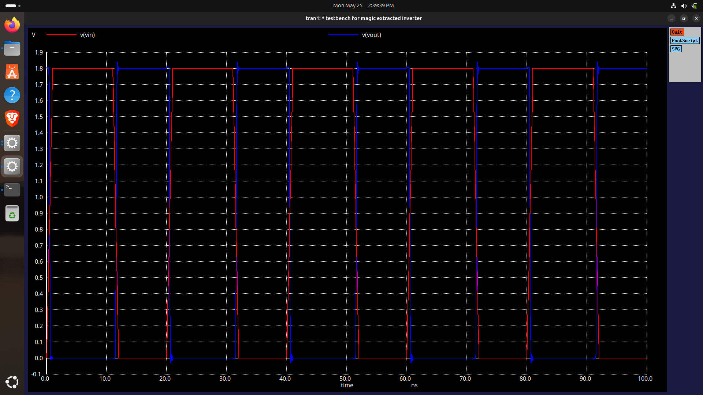

# ⏱️ Timing Analysis of CMOS Inverter

This section presents the timing analysis of the post-layout CMOS inverter implemented using the **SKY130A PDK** and simulated using **ngspice**. Timing analysis is used to evaluate the switching speed of the inverter by measuring propagation delay, rise time, and fall time.

These parameters are important because they determine how quickly the inverter can respond to changes at its input and therefore influence the overall performance of digital circuits.

---

## 1. 📖 Theoretical Background

## Why Timing Analysis?

In digital systems, logic gates require a finite amount of time to respond to input transitions. This delay is caused by transistor switching characteristics and the charging/discharging of load capacitances.

Timing analysis helps determine:

* Switching speed of the inverter
* Signal propagation delay
* Output transition characteristics
* Suitability for high-speed digital applications

---

## 🔹 Input and Output Waveforms

A CMOS inverter produces an output that is the logical complement of its input.

<p align="center">

</p>


### Observations

* When the input changes from LOW to HIGH, the output changes from HIGH to LOW.
* When the input changes from HIGH to LOW, the output changes from LOW to HIGH.
* Output transitions occur after a small delay due to transistor switching and load capacitance.
* The output achieves full rail-to-rail operation between 0 V and VDD.

---

## 🔹 Propagation Delay

Propagation delay is measured between the 50% voltage points of the input and output waveforms.


### High-to-Low Delay

```text
tPHL = tOUT,FALL(50%) − tIN,RISE(50%)
```

This delay corresponds to:

```text
Input : LOW → HIGH
Output: HIGH → LOW
```

---

### Low-to-High Delay

```text
tPLH = tOUT,RISE(50%) − tIN,FALL(50%)
```

This delay corresponds to:

```text
Input : HIGH → LOW
Output: LOW → HIGH
```

---

### Average Propagation Delay

The average propagation delay is defined as:

```text
tp = (tPHL + tPLH)/2
```

This value is commonly used as the overall speed metric of an inverter.

---

## 🔹 Rise Time

Rise time is the time required for the output voltage to increase from 10% to 90% of VDD.

```text
tr = t90% − t10%
```

---

## 🔹 Fall Time

Fall time is the time required for the output voltage to decrease from 90% to 10% of VDD.

```text
tf = t10% − t90%
```

---

### Reference Voltages

For:

```text
VDD = 1.8 V
```

the timing reference levels become:

| Level   | Voltage |
| ------- | ------- |
| 10% VDD | 0.18 V  |
| 50% VDD | 0.90 V  |
| 90% VDD | 1.62 V  |

---

## 2. 🧪 Simulation Setup

### Testbench: `tb_timing_inverter.spice`

```spice
* Propagation Delay & Slew Rate Testbench — sky130A Inverter
* ============================================================

.lib /home/praka/whyRD_eda_bundle/open_pdks/sky130/sky130A/libs.tech/ngspice/sky130.lib.spice tt
.include Inverter.spice

* --- Supply ---
VDD VDD 0 1.8
VSS VSS 0 0

* --- Load capacitance (fanout of 4 equivalent) ---
CL Vout 0 10f

* --- Input pulse: slow edges to see delay cleanly ---
* PULSE(V_low V_high t_delay t_rise t_fall t_on t_period)
VIN Vin 0 PULSE(0 1.8 0 1n 1n 10n 20n)

* --- DUT ---
XINV Vout Vin VSS VDD Inverter

* --- Transient analysis ---
.tran 0.01n 100n

.control
  run

  * ── Waveform plot ──────────────────────────────────────
  plot v(Vin) v(Vout)

  * ── Extract 50% crossing times ────────────────────────
  * Input rising edge  → Vout falling  (t_pHL)
  * Input falling edge → Vout rising   (t_pLH)

  let vref   = 0.9        $ 50% of 1.8V
  let vref10 = 0.18       $ 10% of 1.8V
  let vref90 = 1.62       $ 90% of 1.8V

  * Time when Vin crosses 50% rising (first edge)
  meas tran t_in_rise WHEN v(Vin)=vref RISE=1

  * Time when Vout crosses 50% falling
  meas tran t_out_fall WHEN v(Vout)=vref FALL=1

  * Time when Vin crosses 50% falling (second edge)
  meas tran t_in_fall WHEN v(Vin)=vref FALL=1

  * Time when Vout crosses 50% rising
  meas tran t_out_rise WHEN v(Vout)=vref RISE=1

  * ── Propagation delays ─────────────────────────────────
  let t_pHL = t_out_fall - t_in_rise
  let t_pLH = t_out_rise - t_in_fall
  let t_p   = (t_pHL + t_pLH) / 2

  echo "--- Propagation Delays ---"
  print t_pHL
  print t_pLH
  print t_p

  * ── Slew / transition times ────────────────────────────
  * Fall time: Vout 90% → 10%
  meas tran t_vout_90_fall WHEN v(Vout)=vref90 FALL=1
  meas tran t_vout_10_fall WHEN v(Vout)=vref10 FALL=1

  * Rise time: Vout 10% → 90%
  meas tran t_vout_10_rise WHEN v(Vout)=vref10 RISE=1
  meas tran t_vout_90_rise WHEN v(Vout)=vref90 RISE=1

  let t_fall = t_vout_10_fall - t_vout_90_fall
  let t_rise = t_vout_90_rise - t_vout_10_rise

  echo "--- Slew Rates ---"
  print t_fall
  print t_rise

  * ── Corner sweep hint ──────────────────────────────────
  * Re-run with ff/ss/fs/sf in the .lib line to get
  * best-case and worst-case delay corners.

.endc
.end

```

The post-layout extracted inverter was simulated using transient analysis to evaluate its timing performance.

| Parameter        | Value       |
| ---------------- | ----------- |
| Technology       | SKY130A PDK |
| Simulator        | ngspice     |
| Supply Voltage   | 1.8 V       |
| Analysis Type    | Transient   |
| Simulation Time  | 100 ns      |
| Input Signal     | Pulse Wave  |
| Load Capacitance | 10 fF       |
| Process Corner   | TT          |

---

## 3. 📊 Simulation Results

## 📌 Transient Response

<p align="center">

</p>

### Observations

* Proper inversion behaviour is observed.
* Full rail-to-rail switching is achieved.
* Output transitions follow the input transitions after a finite delay.
* The inverter remains stable throughout the simulation.

---

## 📌 Timing Measurements

The timing parameters were extracted using the ngspice measurement commands included in the testbench.

<p align="center">

</p>

### Measured Values

| Parameter | Symbol | Value |
| --- | --- | --- |
| High-to-Low Delay | tPHL | 190.33 ps |
| Low-to-High Delay | tPLH | 223.38 ps |
| Average Delay | tp | 206.86 ps |
| Fall Time | tf | 239.83 ps |
| Rise Time | tr | 297.39 ps |

---

## 4. 📈 Result Analysis

## 🔹 Propagation Delay

The propagation delay represents the time required for the output to respond to an input transition.

The measured values of tPHL and tPLH indicate the switching speed of the pull-down and pull-up networks respectively.

* **tPHL (190.33 ps):** Represents the fast discharge capability of the NMOS pull-down network.
* **tPLH (223.38 ps):** Reflects the PMOS pull-up charging time. 

A smaller propagation delay indicates higher switching speed and better overall circuit performance.

---

## 🔹 Rise and Fall Times

Rise and fall times describe how quickly the output transitions between logic states.

* **Fall Time (239.83 ps):** The measured fall time indicates efficient discharge of the output node through the NMOS pull-down network.
* **Rise Time (297.39 ps):** The measured rise time indicates efficient charging of the output node through the PMOS pull-up network.

Short rise and fall times indicate:

* Faster switching
* Better signal integrity
* Reduced transition-region operation

---

## 🔹 Overall Timing Performance

The post-layout inverter demonstrates:

* Fast propagation delay
* Full voltage swing
* Stable switching operation
* Clean output transitions

These characteristics indicate good timing performance for digital logic applications.

---

## 5. 📊 Summary

| Metric | Value |
| --- | --- |
| Supply Voltage | 1.8 V |
| Load Capacitance | 10 fF |
| tPHL | 190.33 ps |
| tPLH | 223.38 ps |
| Average Delay (tp) | 206.86 ps |
| Rise Time (tr) | 297.39 ps |
| Fall Time (tf) | 239.83 ps |
| Output Swing | 0 V – 1.8 V |
| Verification Status | ✅ Functional |

---

## 6. ✅ Conclusion

* The post-layout CMOS inverter exhibits correct switching behaviour with full rail-to-rail output operation.
* Timing measurements show fast propagation delay and sharp output transitions.
* The obtained results validate the timing performance of the SKY130A CMOS inverter implementation.


